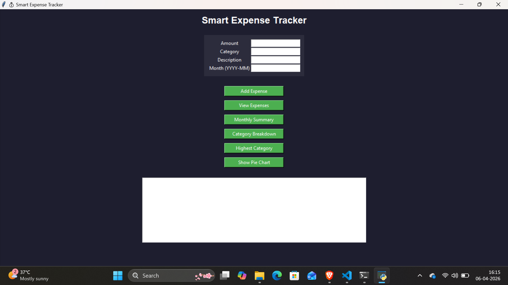
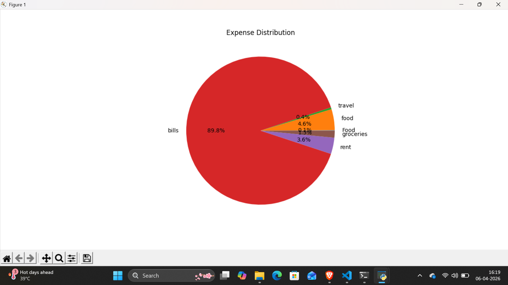
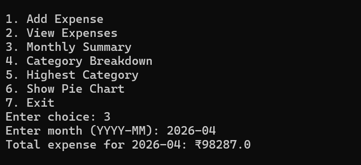

# smart-expense-tracker
A Python-based Smart Expense Tracker with CLI and GUI, featuring expense analysis and visualization.

A Python-based application to track, analyze, and visualize personal expenses using both CLI and GUI.

---

## 🚀 Features

* Add and store expenses
* Categorize spending (Food, Travel, Bills, etc.)
* Monthly expense summary
* Category-wise breakdown
* Highest spending category detection
* Pie chart visualization
* GUI built using Tkinter

---

## 🛠️ Technologies Used

* Python
* Tkinter (GUI)
* JSON (data storage)
* Matplotlib (charts)

---

## 📸 Screenshots

### 🖥️ GUI


### 📊 Pie Chart


### 💻 CLI Output



---

## ▶️ How to Run

### CLI Version

```
python main.py
```

### GUI Version

```
python gui.py
```

---

## 📊 Project Objective

This project helps users track daily expenses and gain insights into spending patterns.

---

## 📌 Future Improvements

* Export to Excel
* Database integration
* Web version using Flask

---

## 👨‍💻 Author

Vivek Gupta

